# CC-sessions

 [](https://badge.fury.io/rb/cc-sessions) 



A simple tool for bookmarking and resuming Claude Code sessions with tags.

Claude Code sessions are tied to directories, making it hard to remember where
you were working on specific projects. This tool lets you tag sessions with
meaningful names and quickly resume them.

<br clear="left"/>

## Features

- **Bookmark sessions** with `/bm tag1 tag2` inside Claude Code
- **Resume sessions** with `cc tag` from anywhere
- **Interactive list** with `cc -l` (arrow keys or j/k to navigate)
- **Delete bookmarks** with `d` in list or `cc -d tag`
- **Auto-install** the `/bm` command and permission on first run
- **Zero dependencies** - pure Ruby

## Installation

### From RubyGems (Recommended)

```bash
gem install cc-sessions
```

### From Source

```bash
git clone https://github.com/isene/CC-sessions.git
cd CC-sessions
./install.sh
```

## Usage

### Bookmarking Sessions

Inside a Claude Code session, use the `/bm` command:

```
/bm rtfm ruby filemanager
```

This bookmarks the current session with three tags. You can later resume it
using any of those tags.

### Resuming Sessions

```bash
cc                     # Continue session in current dir, or start new
cc <tag>               # Resume session bookmarked with <tag>
cc -l, --list          # Interactive list (↑/↓/j/k, Enter, d=delete, q=quit)
cc -d, --delete <tag>  # Delete bookmark matching <tag>
cc -h, --help          # Show help
```

### First Run

On first run, `cc` automatically:
1. Installs the `/bm` command to `~/.claude/commands/`
2. Adds auto-accept permission to `~/.claude/settings.json`

This enables `/bm` to work without confirmation prompts.

## Files

| File | Purpose |
|------|---------|
| `~/.cc-sessions/bookmarks.json` | Stores your bookmarks |
| `~/.claude/commands/bm.md` | The `/bm` command definition |
| `~/.claude/settings.json` | Permission for auto-accept |

## Example Workflow

```bash
# Start working on RTFM project
cd ~/projects/rtfm
claude

# Inside Claude Code, bookmark it
/bm rtfm ruby filemanager

# Later, from anywhere
cc rtfm    # Instantly back in that session

# Or browse all bookmarks
cc -l      # Pick from interactive list
```

## Requirements

- Ruby 2.7+
- Claude Code CLI (`claude`)

## License

This software is released into the public domain under [The Unlicense](https://unlicense.org/).
