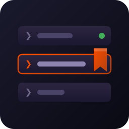

# CC-sessions

   [](https://github.com/isene/fe2o3)



Bookmark and resume Claude Code sessions with tags.

Claude Code sessions are tied to directories, making it hard to remember
where you were working on specific projects. This tool lets you tag
sessions with meaningful names and quickly resume them. Part of the
[Fe2O3](https://github.com/isene/fe2o3) Rust terminal suite.

<br clear="left"/>

## Features

- **Bookmark sessions** with `/bm tag1 tag2` inside Claude Code
- **Check bookmark** with `/bm?` to see current tags
- **Resume sessions** with `cc tag` from anywhere
- **Interactive list** with `cc -l` or `cl` (arrow keys or j/k, J/K to reorder)
- **Running indicator** shows green `●` next to active sessions
- **Auto-follow continuations** — when Claude creates a new session id
  (context reset), the bookmark follows automatically
- **Delete bookmarks** with `d` in the list or `cc -d tag`
- **Auto-install** of the `/bm` command and permission on first run
- **Single static binaries** — no interpreter, instant startup

## Install

```bash
git clone https://github.com/isene/CC-sessions.git
cd CC-sessions
./install.sh
```

This builds the three binaries and symlinks `cc`, `cl` and `cc-bookmark`
into `~/bin`.

## Usage

### Bookmarking Sessions

Inside a Claude Code session, use the `/bm` command:

```
/bm rtfm rust filemanager   # Bookmark with tags
/bm?                        # Show current bookmark status
```

### Resuming Sessions

```bash
cc                     # Continue session in current dir, or start new
cc <tag>               # Resume session bookmarked with <tag>
cc -l, --list          # Interactive list (↑/↓/j/k, J/K reorder, Enter, d, q)
cl                     # Shorthand for cc -l
cc -C, --current       # Show currently running Claude Code sessions
cc -d, --delete <tag>  # Delete bookmark matching <tag>
cc -h, --help          # Show help
```

### First Run

On first run, `cc` automatically:
1. Installs the `/bm` command to `~/.claude/commands/`
2. Adds auto-accept permission to `~/.claude/settings.json`

## Files

| File | Purpose |
|------|---------|
| `~/.cc-sessions/bookmarks.json` | Bookmark storage (file order = picker order) |
| `~/.cc-sessions/resumed/` | Continuation breadcrumbs |
| `~/.claude/commands/bm.md` | The `/bm` command definition |
| `~/.claude/settings.json` | Permission for auto-accept |

## Example Workflow

```bash
# Start working on a project
cd ~/projects/rtfm
claude

# Inside Claude Code, bookmark it
/bm rtfm

# Later, from anywhere
cc rtfm    # Instantly back in that session

# Or browse all bookmarks
cl         # Pick from interactive list
```

## Requirements

- Rust toolchain (build only) — the installed binaries have no runtime dependencies
- Claude Code CLI (`claude`)

## History

v1.x was a Ruby gem. v2.0.0 is a full Rust port: same files, same
commands, same behavior, no interpreter. Existing bookmarks carry over
untouched.

## License

This software is released into the public domain under [The Unlicense](https://unlicense.org/).
Created by Geir Isene — https://isene.org
